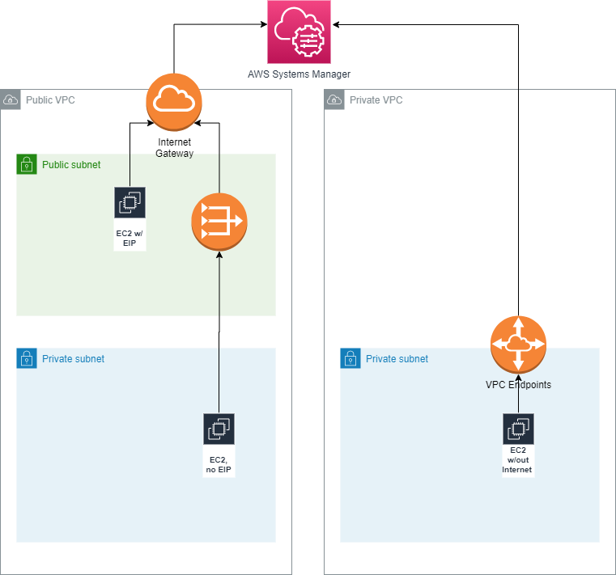
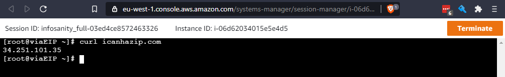
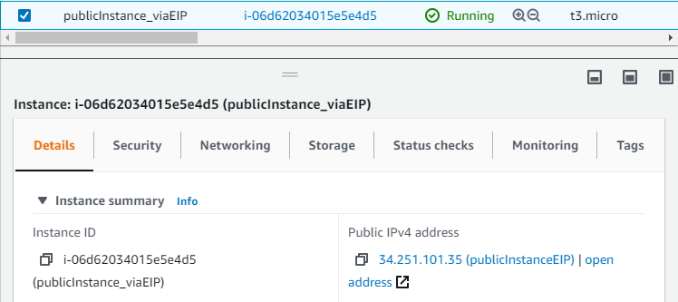
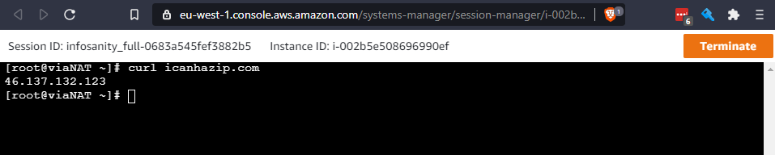
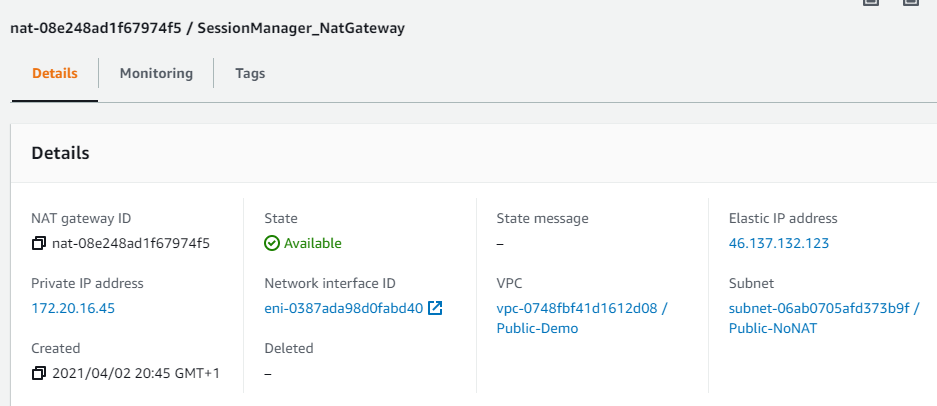
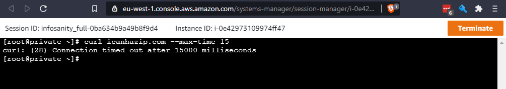

# Session Manager Architecture
## Overview
Typically EC2 instances are encountered in 3 different deployments.

1. With directly attached Elastic IP.
2. Public access, via other architecture (such as NAT gateway or LoadBalancer).
3. Fully private, with no Internet access.

With the correct architecture, Session Manager (via AWS Systems Manager) can be leveraged to remotely manage all EC2 instances; without the need to expose the instances' management services directly.

## Architecture
The below diagram describes the network architecture for each use-case, as deployed by this Terraform code.

## [Shared Prerequisites](https://docs.aws.amazon.com/systems-manager/latest/userguide/systems-manager-prereqs.html)
- EC2 intance must run [SSM Agent](https://docs.aws.amazon.com/systems-manager/latest/userguide/ssm-agent.html)
- IAM Instance role with access to SSM EndPoints
- Access to System Manager endpoints:
    - ec2Messages
    - SSMMessages
    - SS

### Public VPC
Deployment use-cases 1 & 2 are deployed within a public VPC, one with a directly attached elastic IP; the other in a private subnet, accessing the wider Internet via a NAT Gateway.

### Private VPC
For the private instance, if they can't reach the required Systems Manager API endpoints, the services must come to the instance. In this case, via private [VPC endpoints](https://aws.amazon.com/premiumsupport/knowledge-center/ec2-systems-manager-vpc-endpoints/)

## Proof of Concept
Access to each EC2 instance, should be available via Session Manager Connect
### Public, with EIP
Connect Session

Matching assigned public EIP
 

### Public, via NAT Gateway
Connect Session

Matching NAT Gateway

### Private, via private VPC Endpoints
Connect Session

Timing out, due to no Internet access